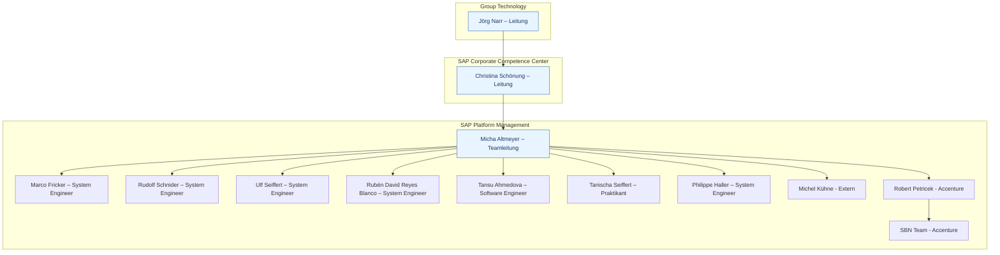

# Wie visualisierst du die Teamstruktur und Verantwortlichkeiten (z.B. Organigramm, RACI-Matrix)?

Das Organigram für SAP Platform Management sieht wie folgt aus:

```mermaid
flowchart TB
  %% Ebenen als Subgraphs
  subgraph GT[Group Technology]
    JN[Jörg Narr – Leitung]
  end

  subgraph CCC[SAP Corporate Competence Center]
    CS[Christina Schönung – Leitung]
  end

  subgraph PLM[SAP Platform Management]
    MA[Micha Altmeyer – Teamleitung]
    MF[Marco Fricker – System Engineer]
    RS[Rudolf Schnider – System Engineer]
    US[Ulf Seiffert – System Engineer]
    RR[Rubén David Reyes Blanco – System Engineer]
    TA[Tansu Ahmedova – Software Engineer]
    TS[Tanischa Seiffert – Praktikant]
    PH[Philippe Haller – System Engineer]
    MK[Michel Kühne - Extern]
    RP[Robert Petricek - Accenture]
    SBN[SBN Team - Accenture]
  end

  %% Berichtslinien
  JN --> CS
  CS --> MA
  MA --> MF
  MA --> RS
  MA --> US
  MA --> RR
  MA --> TA
  MA --> TS
  MA --> PH
  MA --> MK
  MA --> RP
  RP --> SBN

  %% Optionales Styling
  classDef lead fill:#e8f4ff,stroke:#2b6cb0,color:#1a365d;
  class JN,CS,MA lead;
```
