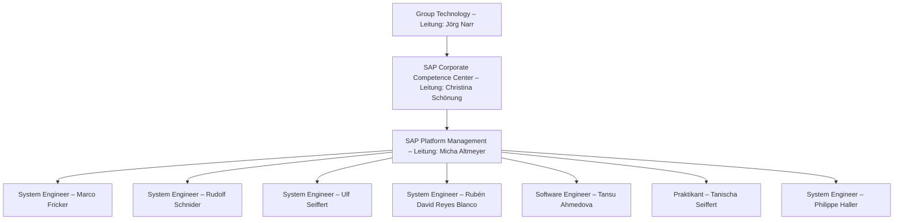

# Frage

Das Organigram sieht wie folgt aus:

```mermaid
graph TB
  GT[Group Technology – Leitung: Jörg Narr]
  CCC[SAP Corporate Competence Center – Leitung: Christina Schönung]
  PLM[SAP Platform Management – Leitung: Micha Altmeyer]
  SE_MF[System Engineer – Marco Fricker]
  SE_RS[System Engineer – Rudolf Schnider]
  SE_US[System Engineer – Ulf Seiffert]
  SE_RR[System Engineer – Rubén David Reyes Blanco]
  SWE_TA[Software Engineer – Tansu Ahmedova]
  PRA_TS[Praktikant – Tanischa Seiffert]
  SE_PH[System Engineer – Philippe Haller]

  GT --> CCC
  CCC --> PLM
  PLM --> SE_MF
  PLM --> SE_RS
  PLM --> SE_US
  PLM --> SE_RR
  PLM --> SWE_TA
  PLM --> PRA_TS
  PLM --> SE_PH

```
